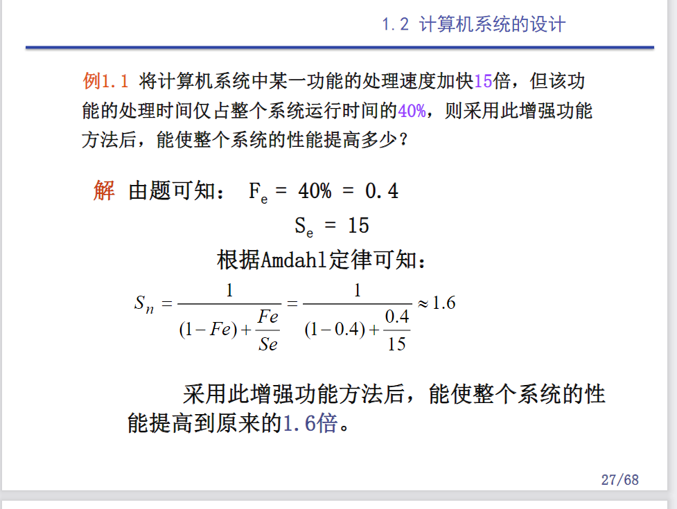

## 第一章

### Amadhl定律

加快某部件执行速度所能获得的系统性能加速比，受限于该部件的执行时间占系统中总执行时间
的百分比。

系统加速比：

$ T(加速比) = \frac{系统性能(改进后) }{ 系统性能(改进前) } = \frac{总执行时间(改进前)}{总执行时间(改进后)}$ 

加速比依赖于两个因素：
1. 可改进比例 (Fe，Fraction of Execution time that is Enhanced): 在改进前的系统中，可改进部分的执行时间在总的执行时间中所占的比例。
(总是小于等于1)
2. 部件加速比(Se，Speedup Efficiency)：可改进部分改进以后性能提高的倍数。它是改进前所需的执行时间与改进后执行时间的比。

改进后程序的总执行时间$T_n$

$T_n = T_0(1-Fe+\frac{Fe}{Se})$

系统加速比$S_n$(改进前后总执行时间之比)

$S_n=\frac{T_0}{T_n}=\frac{1}{(1-Fe)+\frac{Fe}{Se}} $

### CPU时间

$CPU时间 = 执行程序所需的时间周期数 \times 时间周期数$

$时间周期数是系统时钟频率的倒数$

$CPI(每条指令执行的平均时钟周期数量) =  时间周期数 / IC(执行的指令条数)$

$CPU时间 = IC(指令条数) \times CPI(指令平均时间周期数) \times 时间周期时间$

CPU的性能取决于三个参数：
1. 时间周期时间：取决于硬件实现技术和计算机组成
2. CPI(Cycles Per Instruction)：取决于计算机组成和指令系统的结构
3. IC(Instruction Count)：取决于指令系统的结构和编译技术

$ CPU时间周期数 = \sum_{i=1}^n({CPI_i}{\times}{IC_i} ) $

$ CPU时间 = 执行程序所需时钟周期数 \times 时钟周期时间 = \sum_{i=1}^n({CPI_i} {\times}{IC_i}) \times 时间周期时间 $
$ CPI = \frac{时钟周期数}{IC} = CPI * \sum_{i=1}^n({\frac{IC_i}{IC}}) $

### MIPS

每秒百万指令数

## 第三章
